# DevHeat

Android app to automate GitHub profile edition and README creation.

## How to use it?

Firstly, you will be on the main screen with no users.
You need to click on "Add user".
Each user will save it's own information.

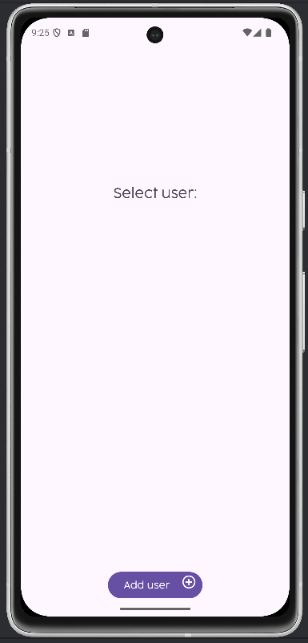
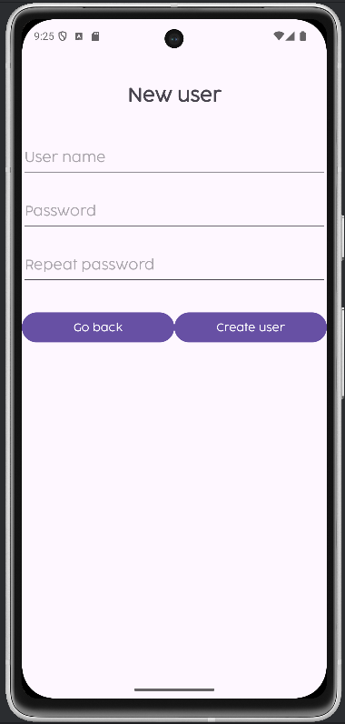

Then, You will need to login, clicking at the button that screens your user name, and write it's password.

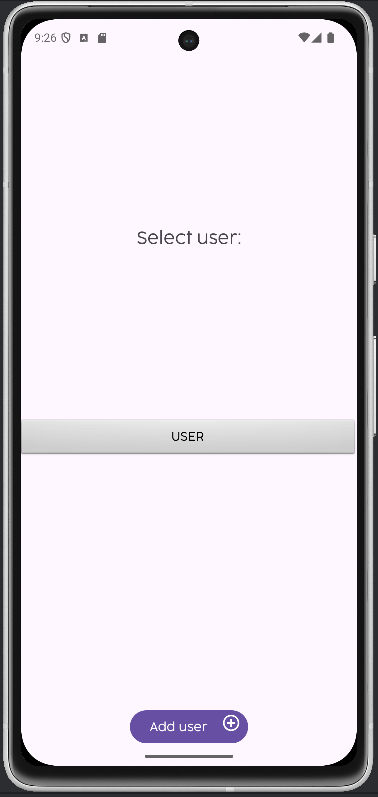
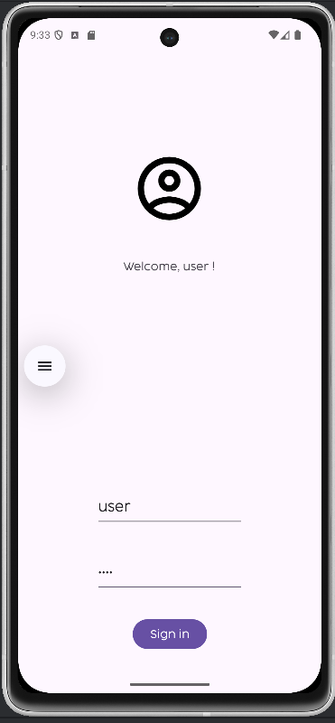

You will enter to the Markdown creation tool.
Add your selected category along with the desired text
You have to add a category each time you want to change the category.

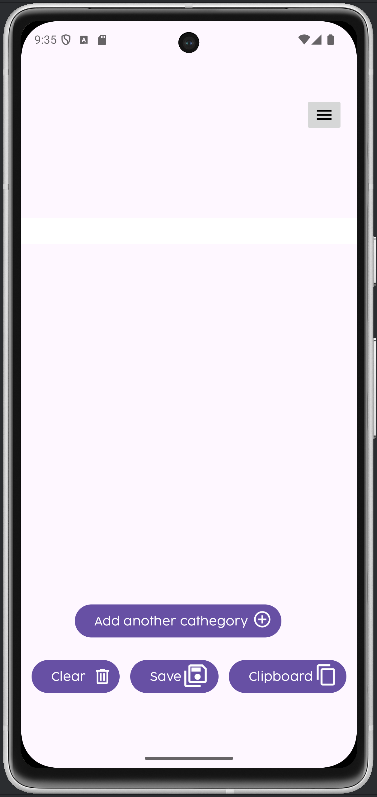
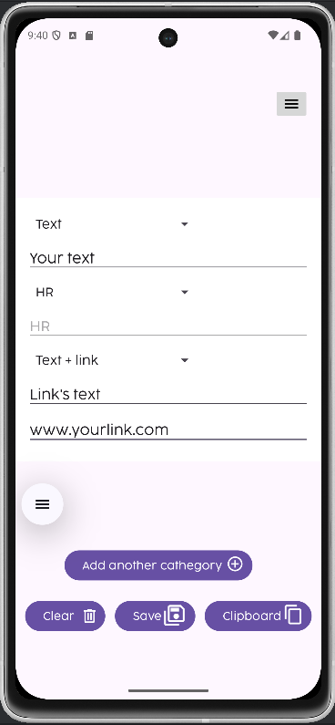

You can:
 - Save at default location
 - Change the path where you want to save your file.
 - Star the file. If you are planning to change the main Readme form your GitHub Account, this is what you need to do.

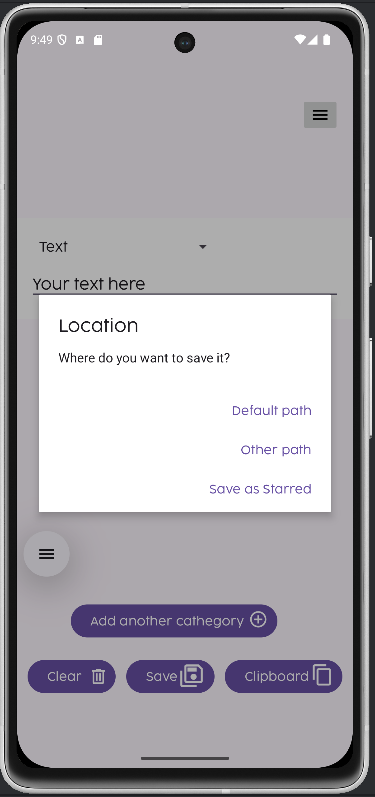
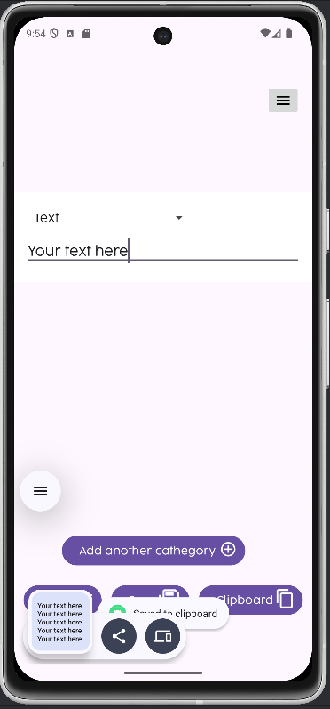

By clicking the menu Icon at the right corner, you will see your information. 

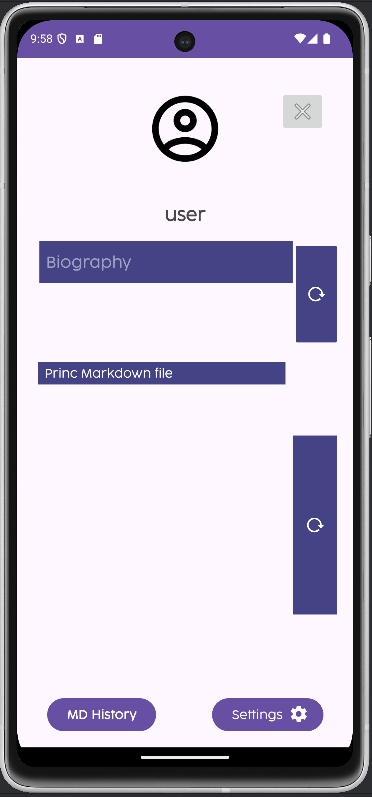
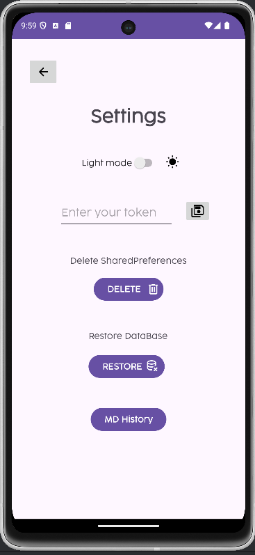

To link your DevHeat's account with your Github account, you need to enter your Personal Acces Token.
Don't worry, this app won't share or upload your token or any information for other purposes apart from what you want.

Also, you can change the light theme! It will work all over the app.

> [!CAUTION]
> If you click on 'delete database', it will delete all the users and their information.

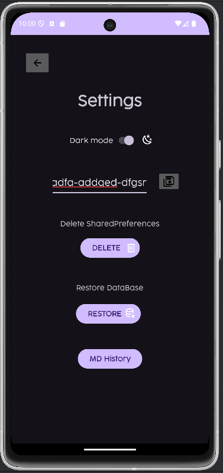
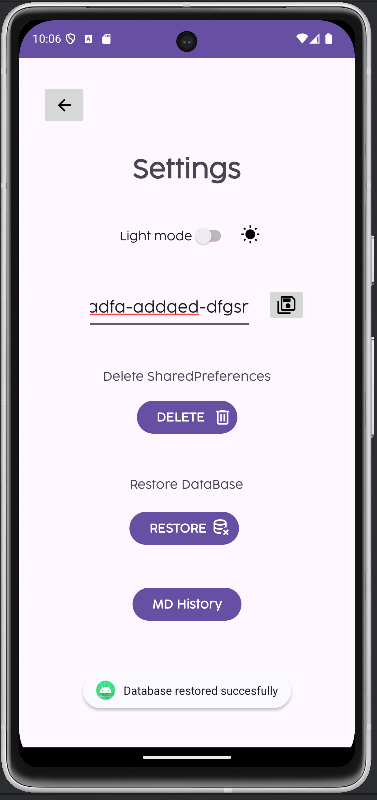

Once the token is saved, you can change your Github bio, or change your main Readme!
Once the changes are made, your GitHub account will be updated instantly, and could look like this:

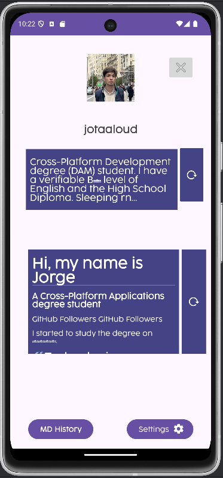
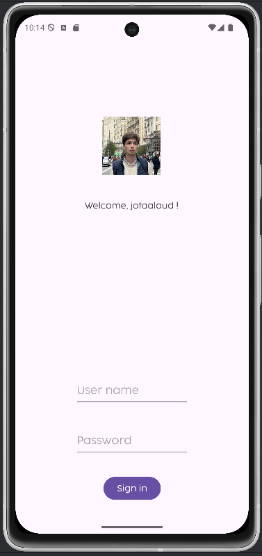

    
Click here for technical info

I used SQLite, SharedPreferences, Internal Storage, XML elements generation...

There are 5 activities:

## MainActivity

Starts the <ins>SQLite database</ins> and loads the users into new <ins>XML Buttons</ins> with theirnames.

When you click on the username, his name and his password are added to the 'login' activity via <ins>'putExtra'</ins> on it's intent.

## New user

You can create new users with a name and a password, and the users will be inserted into the SQLite database.

## Login

Gets the extras setted on 'MainActivity' and sets the TextView welcoming the user. If the Username and his password are correct, the next activity will start.

## Template

It starts with one Spinner with several options to add to the Readme generatos (Titles, text, text with a link...)
and a Button. If you click the button, it will generate another <ins>XML Spinner</ins>. You can generate countless Spinners.

Each spinner has an 'onChangeListener'. Based on the selected option, a new EditText is added below. 
These EditText instances are added to a list for later access to their content.

3 Buttons on bottom:

 - bntClipoard: Saves the README into the clipboard with the ClipboardManager.
 - btnClearOptions: Deletes the content of the readme by removing all views from the container.
 - btnSave: saves the readme file into the internal storage with <ins>FileOutputStream</ins>, and lets the user choose between the predetermined path or other path, with an AlertDialog.

## Menu

2 Buttons:
 - deleteSP: deletes the SharedPreferences.
 - deleteDB: truncates the database, eliminates all the users.

A Switch:

Lets the user choose between the dark-mode or the light-mode, and stores the option at the <ins>SharedPreferences</ins>.

